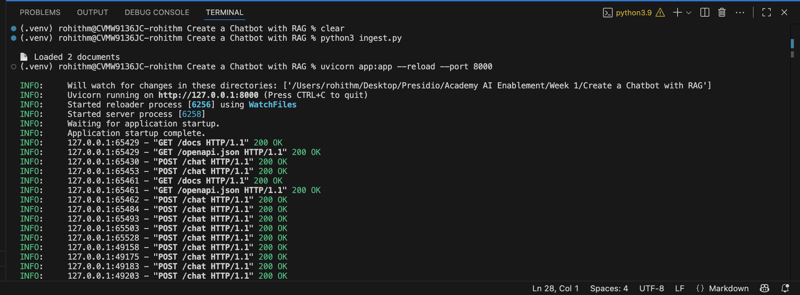
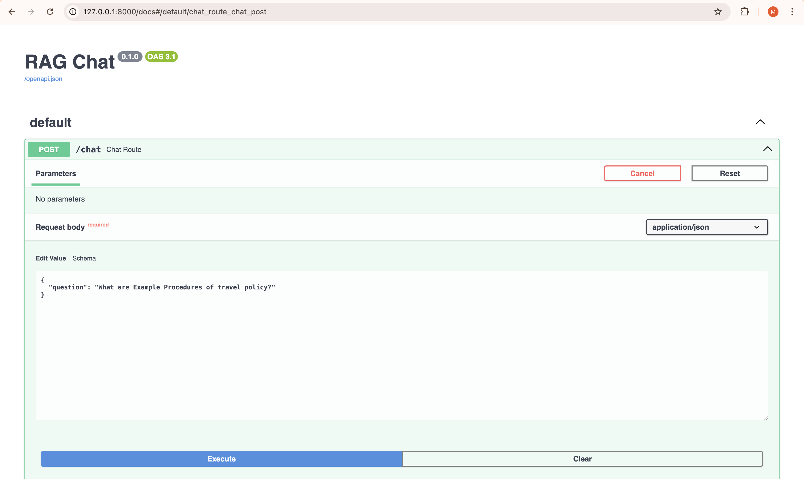
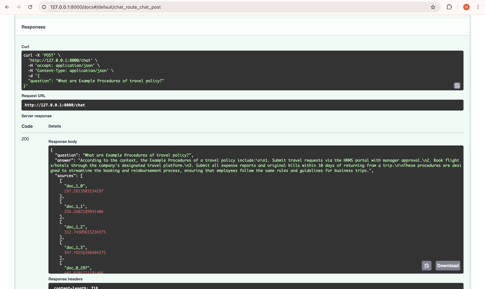
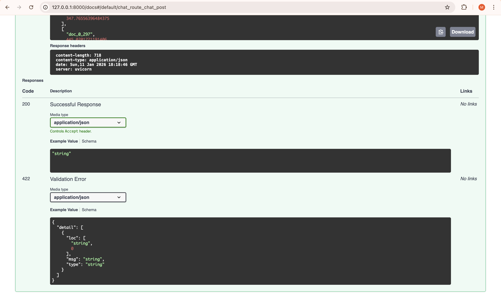

# 📚 RAG-based Chatbot using Ollama + ChromaDB (No LangChain)

This project implements a **Retrieval-Augmented Generation (RAG) chatbot from scratch** using:

- **Ollama** for embeddings and LLM inference (fully local)
- **ChromaDB** as the vector database
- **FastAPI** for serving a REST API
- **Python** only (no LangChain, no LlamaIndex)

The chatbot can answer questions based on **PDF, DOCX, and TXT documents** you upload.

---

## 🧠 What is RAG?

**Retrieval-Augmented Generation (RAG)** enhances Large Language Models by:

1. Retrieving relevant information from external documents
2. Injecting that information into the LLM prompt
3. Generating grounded, factual answers

This avoids hallucinations and ensures answers are based on your documents.

---

## 🏗️ High-Level Architecture

Documents (PDF / DOCX / TXT)\
↓\
Text Extraction\
↓\
Chunking\
↓\
Ollama Embeddings (nomic-embed-text)\
↓\
ChromaDB (Vector Store)\
↓\
Query Embedding\
↓\
Top-K Retrieval\
↓\
Prompt Construction\
↓\
Ollama LLM (e.g., mistral)\
↓\
Answer via FastAPI


---

## 📁 Project Structure

Create a Chatbot with RAG/\
│\
├── app.py # FastAPI application (chat endpoint)\
├── ingest.py # Document ingestion pipeline\
├── embeddings.py # Ollama embedding logic\
├── llm.py # Ollama LLM inference\
├── rag_store.py # ChromaDB vector store\
├── document_loaders.py # PDF / DOCX / TXT loaders\
├── utils.py # Text chunking utility\
├── config.py # Environment-based configuration\
├── documents/ # Upload your documents here\
├── chroma_db/ # Persistent ChromaDB storage\
├── requirements.txt\
└── README.md


---

## ⚙️ Configuration (`config.py`)

```python
OLLAMA_BASE_URL = http://localhost:11434
EMBED_MODEL = nomic-embed-text
LLM_MODEL = mistral
TOP_K = 5
```

These values are loaded from a .env file using python-dotenv.

---

## Example .env

```
OLLAMA_BASE_URL=http://localhost:11434
EMBED_MODEL=nomic-embed-text
LLM_MODEL=mistral
TOP_K=5
```

---

## 📄 Document Loading (document_loaders.py)

This module loads and extracts text from multiple file formats.

**Supported Formats**

- .pdf → via pypdf

- .docx → via python-docx

- .txt → plain text

---

## Key Function

```
load_documents("documents")
```

- Iterates over all files in the documents/ folder

- Extracts raw text

- Returns a list of document strings

---

## ✂️ Text Chunking (utils.py)

```
def chunk_text(text, chunk_size=500, overlap=50):
```

---

## Why chunking?

- Embedding models have token limits

- Smaller chunks improve retrieval accuracy

---

## How it works

- Splits text into overlapping chunks

- Overlap preserves context across boundaries

---

## 🧬 Embeddings (embeddings.py)

Uses Ollama Embeddings API.

```
POST /api/embeddings
```

---

## Model Used

nomic-embed-text

---

## Key Safety Checks

- Empty text → skipped

- Empty embedding → skipped

This prevents ChromaDB ingestion errors.

---

## 🗄️ Vector Store (rag_store.py)

Uses **ChromaDB PersistentClient**.

```
client = chromadb.PersistentClient(path="./chroma_db")
```

---

## Why persistence?

- Data survives app restarts

- No need to re-ingest every time

---

## Functions

**Add documents**

```
add_to_store(doc_id, text, embedding)
```

**Query documents**

```
query_store(query_embedding, top_k)
```

Returns:

- Top matching documents

- Their IDs

- Distance scores (similarity)

---

## 📥 Ingestion Pipeline (ingest.py)

This script **must be run once (or whenever documents change)**.

**What it does**

- Loads documents

- Chunks text

- Generates embeddings

- Stores them in ChromaDB

---

## Run it

```
python3 ingest.py
```

---

## 🤖 LLM Inference (llm.py)

Uses Ollama Generate API:

```
POST /api/generate
```

Key Features

- Fully local inference

- No streaming (simpler setup)

- Returns clean text output

---

## 🚀 FastAPI Application (app.py)

**Endpoint**

```
POST /chat
```

**Request Body**

```
{
  "question": "What is the expense limit for accommodation?"
}
```

**Processing Flow**

- Generate embedding for the question

- Retrieve top-K relevant chunks from ChromaDB

- Build a grounded prompt

- Call Ollama LLM

- Return answer + sources

**Response**

```
{
  "question": "...",
  "answer": "...",
  "sources": [["doc_0_2", 0.12]]
}
```
---


## ▶️ How to Run the Application

**1️⃣ Start Ollama**

```
ollama serve
```

Pull required models:
```
ollama pull nomic-embed-text
ollama pull mistral
```

**2️⃣ Create Virtual Environment**

```
python3 -m venv .venv
source .venv/bin/activate
pip install -r requirements.txt
```


**3️⃣ Add Documents**

Place your files here:

```
documents/
├── travel_policy.docx
├── manual.pdf
└── notes.txt

```


**4️⃣ Ingest Documents**

```
rm -rf chroma_db
python3 ingest.py
```

**5️⃣ Start API Server**

```
uvicorn app:app --reload --port 8000
```

**6️⃣ Test the Chatbot**

Open:
```
http://127.0.0.1:8000/docs
```

Or via curl:

```
curl -X POST http://127.0.0.1:8000/chat \
  -H "Content-Type: application/json" \
  -d '{"question":"What is the accommodation expense limit?"}'
```

---

## Output









---

## ✅ Key Advantages of This Implementation

- 🔒 Fully local (no external APIs)

- 🧩 Modular and readable

- 🧠 No hallucinations (context-grounded)

- 🚫 No LangChain / LlamaIndex

- 📄 Multi-document support

- 💾 Persistent vector store

---

## 🔮 Possible Enhancements

- Source filenames & page numbers

- Streaming responses

- Chat history memory

- Hybrid search (BM25 + vectors)

- Web UI

- Dockerization

- Cloud deployment (Azure / AWS)

---

## 🏁 Conclusion

This project demonstrates a clean, production-grade RAG system built from scratch using modern open-source tools.
It is ideal for learning, internal knowledge bots, and enterprise prototypes.

---
