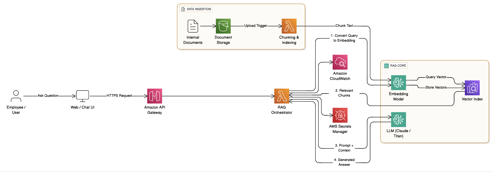

# AWS Retrieval-Augmented Generation (RAG) Architecture

## 📌 Overview
This repository demonstrates a **Retrieval-Augmented Generation (RAG)** architecture implemented using **AWS cloud services**.  
The solution enables users to query enterprise knowledge (policies, SOPs, project documents) and receive **accurate, context-aware responses** generated by a Large Language Model (LLM).

The architecture follows AWS best practices and is:
- Scalable
- Secure
- Cost-efficient
- Production-ready

---

## 🧠 What is RAG?
**Retrieval-Augmented Generation (RAG)** combines:
1. **Retrieval** – Fetching relevant information from external knowledge sources
2. **Augmentation** – Injecting retrieved context into the prompt
3. **Generation** – Producing a grounded answer using an LLM

This approach significantly reduces hallucinations and improves answer accuracy.

---

## 🎯 Use Case – Enterprise Knowledge Assistant

Employees can ask questions such as:
- “What is our leave policy?”
- “Explain the onboarding process”
- “How do I deploy the application?”

The system retrieves relevant internal documents and generates an accurate response.

---

## 🏗️ High-Level Architecture Flow

**Retrieve → Augment → Generate**

1. User submits a query via UI
2. Query is embedded and searched in vector database
3. Relevant document chunks are retrieved
4. Context is added to the prompt
5. LLM generates a final answer

---

## 🧩 AWS Services Used & Justification

### 👤 User Interface
**Web / Chat UI**
- Provides a conversational interface
- Can be built using React, Angular, or any SPA

---

### 🌐 API Layer
### Amazon API Gateway
**Why?**
- Secure API entry point
- Handles throttling, routing, and scaling

**Role:**
- Routes user queries to backend Lambda

---

### ⚙️ Backend Orchestration
### AWS Lambda (RAG Orchestrator)
**Why?**
- Serverless and cost-efficient
- Automatically scales
- Easy integration with AWS services

**Role:**
- Manages the entire RAG flow
- Calls embedding model
- Queries vector database
- Sends augmented prompt to LLM

---

### 🧠 AI & RAG Core
### Amazon Bedrock – Embedding Model
**Why?**
- Fully managed foundation models
- No infrastructure management

**Role:**
- Converts queries and document chunks into embeddings

---

### Amazon OpenSearch Service (Vector Search)
**Why?**
- Native vector similarity search
- Highly scalable
- AWS-managed

**Role:**
- Stores embeddings
- Retrieves most relevant document chunks

---

### Amazon Bedrock – LLM (Claude / Titan)
**Why?**
- Managed LLMs with enterprise security
- No model hosting required

**Role:**
- Generates responses using query + context

---

### 📂 Knowledge Storage
### Amazon S3
**Why?**
- Durable and low-cost storage
- Event-driven processing

**Role:**
- Stores enterprise documents (PDFs, DOCs, manuals)

---

### Ingestion Lambda (Indexer)
**Why?**
- Automates document processing
- Serverless and scalable

**Role:**
- Triggered on S3 upload
- Extracts text
- Splits into chunks
- Generates embeddings
- Indexes data in OpenSearch

---

### 🔐 Security & Monitoring
### AWS Secrets Manager
- Secure storage of credentials and keys

### Amazon CloudWatch
- Logs, metrics, and monitoring

---

## 🔄 End-to-End Workflow

### Query Flow
1. User sends query
2. API Gateway routes request
3. Lambda converts query to embedding
4. OpenSearch retrieves relevant chunks
5. Lambda augments prompt
6. Bedrock LLM generates answer
7. Response returned to user

---

### Document Ingestion Flow
1. Documents uploaded to S3
2. S3 event triggers Indexer Lambda
3. Text is chunked
4. Embeddings generated
5. Stored in OpenSearch

---

## 🏆 Benefits
- Accurate and grounded answers
- Reduced hallucinations
- Fully serverless
- Secure and scalable
- Easy to extend

---

## 🚀 Future Enhancements
- Amazon Cognito authentication
- Redis caching
- Feedback loop
- Streaming responses
- Multi-LLM routing

---

## 📌 Conclusion
This AWS RAG architecture provides a robust, scalable, and secure solution for enterprise knowledge retrieval using modern generative AI patterns.

---

