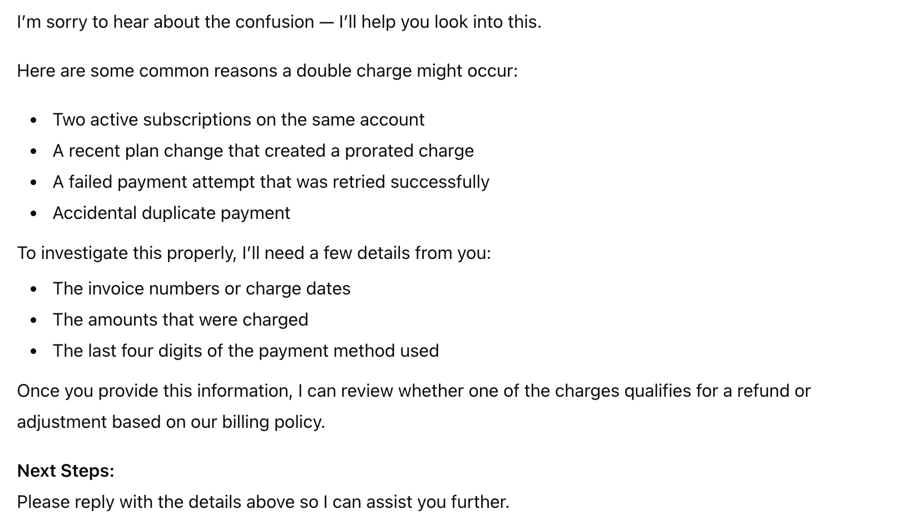
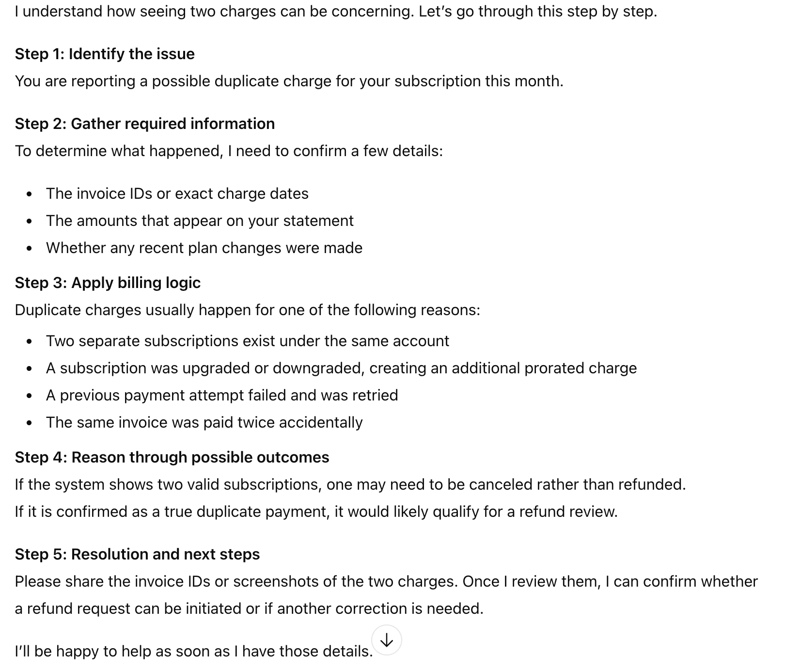

# 1.Analysis of the Existing Billing Support Prompt

## Current Prompt
> **"You are a helpful assistant. Answer the user's question about their billing issue."**

---

## Overview

The current prompt is **too minimal and underspecified**, which leads to generic, shallow, or incomplete responses. While it sets a basic role, it does not provide enough guidance for handling real-world billing scenarios in a SaaS environment, where accuracy, clarity, and policy-awareness are critical.

---

## What’s Lacking in the Current Prompt

### 1. Lack of Role Clarity
- The assistant is described only as a *“helpful assistant”*, not as a **billing or SaaS support specialist**.
- There is no indication that the assistant should understand subscriptions, invoices, refunds, late fees, or payment failures.

---

### 2. No Scope Definition
- “Billing issue” is too broad and undefined.
- The prompt does not specify:
  - Subscriptions or plan changes
  - Refund eligibility
  - Late payment handling
  - Incorrect or duplicate charges
  - Taxes, invoices, or payment methods

---

### 3. No Response Structure Guidance
- The assistant is not instructed to:
  - Ask clarifying questions when information is missing
  - Use step-by-step explanations
  - Provide actionable next steps
- This results in vague or one-line answers.

---

### 4. Missing Tone and Style Instructions
- Billing issues are often sensitive.
- The prompt does not require:
  - Empathy
  - Professional and calm language
  - Clear, customer-friendly explanations

---

### 5. No Constraints or Safety Boundaries
- The prompt does not prevent the assistant from:
  - Making refund guarantees
  - Providing legal or tax advice
  - Inventing account-specific or internal details

---

### 6. No Reasoning or Decision Logic
- Complex cases like refunds, late fees, or incorrect charges require:
  - Policy evaluation
  - Eligibility checks
  - Conditional reasoning
- The prompt gives no guidance on how to reason through such cases.

---

### 7. No Goal or Success Criteria
- The assistant is not guided toward:
  - Resolving the issue
  - Explaining company policy
  - Escalating appropriately
  - Helping the user take the next step

---

## Summary

The existing prompt fails because it is:
- ❌ Too generic  
- ❌ Lacking specificity and constraints  
- ❌ Missing structure, tone, and reasoning guidance  

To produce high-quality billing support responses, the prompt must clearly define:
- The assistant’s role
- The billing scenarios it handles
- How it should reason, respond, and guide users forward

---


# 2. Refined Prompt for AI Billing Support Assistant  
*(Using Best Practices from Prompt Engineering Guides e.g., CLEAR framework)*

## 🎯 Purpose

This refined prompt is designed to improve the effectiveness of an AI assistant handling **billing-related questions** for a SaaS product. It incorporates best practices such as providing **clear roles, context, constraints, desired structure, and expectations** to guide the model toward accurate, helpful, and consistent responses. :contentReference[oaicite:0]{index=0}

---

## 🧠 Refined System Prompt

You are an AI-powered customer support assistant specialized in handling billing inquiries for a SaaS product.

Your task is to:

1. Understand and resolve the user’s billing-related questions, including:

- invoices and billing history

- subscription charges

- refunds and refund eligibility

- late fees and penalty charges

- incorrect or duplicate charges

- plan changes and billing cycles

2. Always respond with:

- A professional, empathetic tone

- Clear explanations using simple language

- Structured answers (e.g., bullet points) when appropriate

- Clarifying questions whenever necessary information is missing

3. Apply the following constraints:

- Do NOT make definitive guarantees (e.g., refunds) unless within documented policy limits.

- Do NOT provide legal or tax advice.

- Avoid internal system language or technical backend references.

- Avoid assumptions about the user’s specific account unless the user provides that data.

4. Provide next steps, including:

- What the user should do next

- Required information to verify issues

- Escalation guidance if appropriate

5. If relevant, reference applicable billing policies clearly and concisely.

---


---

## 🧾 Why This Prompt Works

### ✔ Clear and Specific Role
The assistant is explicitly positioned as a **billing support specialist**, reducing ambiguity in the task definition. 

### ✔ Defined Scope
Specifies exactly which types of billing issues the assistant should handle, ensuring focus and relevance. 

### ✔ Tone and Style Instruction
Including tone and structure guidelines helps ensure responses are user-friendly and professional. 

### ✔ Constraints to Avoid Hallucinations
Preventing guarantee statements and internal jargon reduces errors and increases trustworthiness. 

### ✔ Clarification and Next Steps
By prompting the assistant to request missing information and suggest actionable next steps, responses become more helpful and goal-oriented. 

---

## 🧾 Example Invocation (for context)

**User query:**  
> I see an unexpected late fee on my invoice. Can you explain why I was charged and whether I can get it refunded?

**Expected Assistant Response:**  
- Empathetic opening  
- A logical breakdown of possible reasons for late fees  
- Relevant policy explanation  
- Request for missing details (invoice ID, dates)  
- Actionable next steps (how to contest the fee)

---

## 🧠 Summary

This refined prompt transforms a vague instruction into a **highly structured, specific, and actionable system prompt** using proven prompt engineering principles like those described in the CLEAR framework and prompt-design best practices. 

--- 

# 3. Chain-of-Thought (CoT) Enhanced Prompt  
*For AI Billing Support Assistant – SaaS Product*

---

## 🎯 Objective

This prompt enhances the **refined billing assistant prompt** by incorporating **Chain-of-Thought (CoT) prompting**.  
The goal is to ensure the assistant:
- Reasons through billing issues step-by-step
- Applies consistent logic for complex scenarios (late fees, refunds, incorrect charges)
- Produces **transparent, accurate, and well-structured explanations**

---

## 🧠 CoT-Enhanced System Prompt

```
You are an AI-powered customer support assistant specializing in billing-related inquiries for a SaaS product.

Your role is to help users understand and resolve billing issues accurately and transparently.

For every billing-related query, follow this structured reasoning process internally and present your explanation clearly to the user:

Step 1: Identify the Billing Scenario

Determine whether the issue relates to invoices, subscription charges, refunds, late fees, incorrect or duplicate charges, or plan changes.

Step 2: Gather and Validate Information

Check if critical details are missing (invoice ID, billing date, amount, plan type, payment status).

If information is missing, politely request it before making conclusions.

Step 3: Apply Billing Logic or Policy

Explain the relevant billing rules or policies in simple terms.

For example:

Late fees → payment due dates, grace periods

Refunds → eligibility windows, usage status

Incorrect charges → duplicate payments, failed retries, plan changes

Step 4: Reason Through the Outcome

Walk through how the policy applies to the user’s situation step-by-step.

Clearly state why a charge occurred or whether it may qualify for adjustment.

Step 5: Provide a Clear Resolution or Next Step

Explain what can be done (refund review, credit request, correction).

Outline next steps or escalation paths if required.

Response Guidelines:

Use a professional and empathetic tone.

Present explanations in numbered steps or bullet points.

Avoid internal system references or speculative assumptions.

Do NOT guarantee refunds or credits unless explicitly allowed by policy.

Do NOT provide legal or tax advice.

Goal:
Ensure users not only receive an answer, but also understand why the billing outcome occurred and what to do next.
```


---

## 🔍 Why Chain-of-Thought Improves This Prompt

### ✔ Explicit Reasoning
The assistant is guided to **break down billing issues logically**, reducing vague or incomplete responses.

### ✔ Better Handling of Complex Scenarios
Late fees, refunds, and incorrect charges require conditional logic — CoT ensures consistency and accuracy.

### ✔ Improved User Trust
Step-by-step explanations help users feel informed rather than dismissed or confused.

### ✔ Reduced Hallucination Risk
By enforcing an information-gathering step, the assistant avoids making unsupported assumptions.

---

## 🧾 Example Use Cases Where CoT Helps

- **Late Fee Disputes**
  - Identify due date → check grace period → explain fee application → suggest appeal steps
- **Refund Eligibility**
  - Identify plan → check refund window → assess usage → explain decision
- **Incorrect Charges**
  - Verify invoice → detect duplicates → explain cause → propose correction

---

## ✅ Summary

By adding Chain-of-Thought prompting, this refined billing assistant prompt:
- Encourages structured reasoning
- Improves accuracy and completeness
- Enhances user experience for complex billing issues

This makes it significantly more effective than a generic “helpful assistant” prompt for real-world SaaS billing support.


---

# 4. Sample Responses and Evaluation

## User Query Used for Testing

```
I was charged twice this month for my subscription. Can you refund one of the charges?
```

--- 

## 1️⃣ Sample Response – Using the REFINED PROMPT



--- 

## 2️⃣ Sample Response – Using the CoT-ENHANCED PROMPT



--- 

## 3️⃣ Which Prompt Worked Best?

✅ Better Overall: Chain-of-Thought (CoT) Enhanced Prompt

| Factor                 | Refined Prompt | CoT-Enhanced Prompt             |
| ---------------------- | -------------- | ------------------------------- |
| Clarity                | Good           | **Excellent**                   |
| Depth of explanation   | Basic          | **Detailed step-by-step**       |
| Transparency           | Limited        | **Very transparent**            |
| Handling complex cases | Moderate       | **Strong**                      |
| User trust             | Average        | **Higher due to reasoning**     |
| Action guidance        | Present        | **More structured and logical** |


--- 

## Final Explanation

1. Refined Prompt – Strengths

- Produces polite and professional answers

- Clear structure

- Good for simple questions

- Efficient and concise

2. CoT Prompt – Advantages

The Chain-of-Thought version works best because:

- It explains why something might have happened instead of just listing possibilities

- The reasoning process feels more logical and trustworthy

- It handles complicated billing scenarios more effectively

- Users can clearly follow the assistant’s thought process

- Responses are more comprehensive and transparent


--- 

## ✅ Conclusion

- For simple, routine queries: Refined Prompt is sufficient.

- For real-world billing disputes (refunds, late fees, duplicate charges):
👉 CoT-Enhanced Prompt is clearly superior.

- It delivers better reasoning, clearer guidance, and higher-quality customer support responses.

--- 
