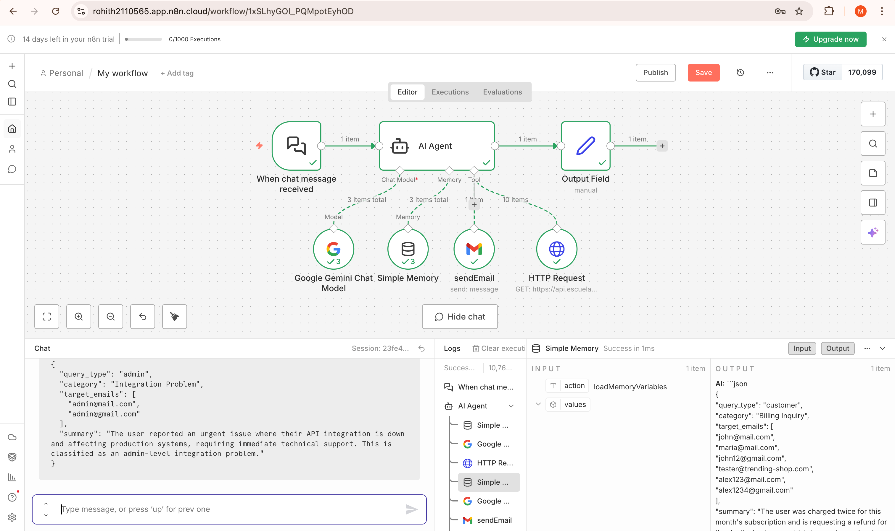
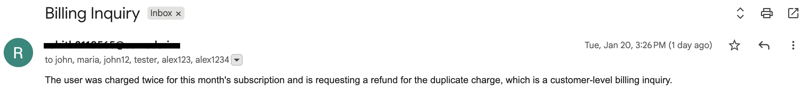
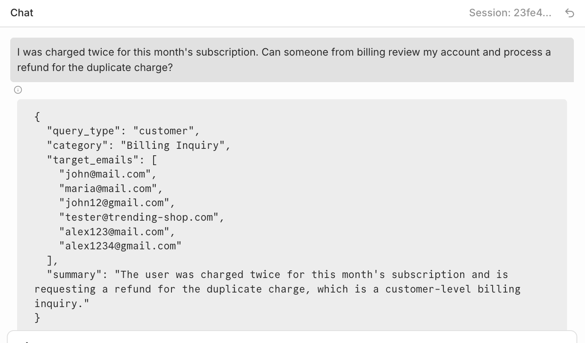
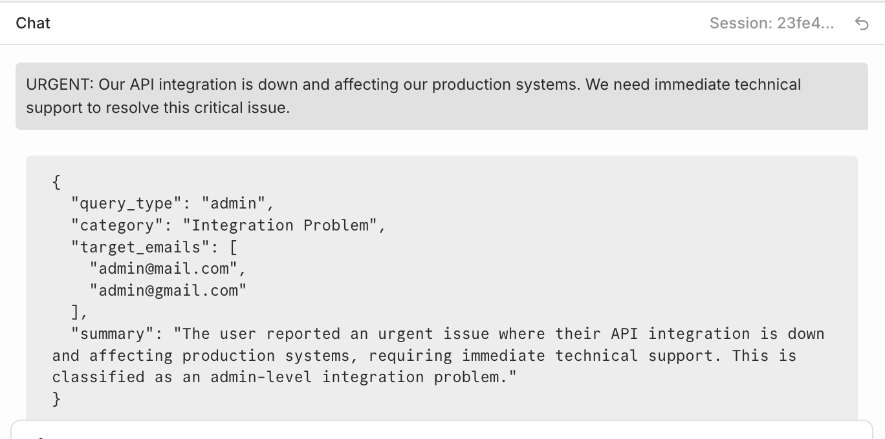

# Smart Gmail Agent with n8n



---

## Overview

This project demonstrates how to build a **Smart Gmail Agent** using **n8n, LLM-based classification,** and **role-based email routing**.

The agent automatically:

- Receives user messages (chat or email-style input)

- Classifies the intent using an AI model

- Fetches users dynamically from an external API

- Routes the message to the correct recipients (Customer or Admin)

- Sends emails via Gmail without manual intervention

This is a practical example of **Agentic AI orchestration** using tools and memory inside n8n.

---

## Architecture Overview

```
Chat Trigger
     ↓
AI Agent (LLM-powered reasoning)
     ↓
HTTP Request Tool (Fetch users)
     ↓
Classification + Email Routing
     ↓
Gmail Tool (Send Email)
```

--- 

## Workflow Components

### 1. Chat Trigger Node

**Node Name:** When chat message received

- Acts as the entry point of the workflow

- Triggers whenever a new chat message is received

- Used to simulate incoming support or system-related queries

### 2. AI Agent Node

**Node Name:** AI Agent

- Core intelligence of the workflow

- Uses an LLM to:

1. Understand the incoming message

2. Classify it into predefined categories

3. Decide whether it is a Customer or Admin query

- Orchestrates tools such as:

1. HTTP Request

2. Gmail Send Email

- Maintains conversation context using memory

### 3. Language Model

**Node Name:** Google Gemini Chat Model

- Provides natural language understanding and reasoning

- Connected as the ai_languageModel to the AI Agent

- Used for:

1. Intent detection

2. Query classification

3. Structured JSON output generation

### 4. HTTP Request Tool

**Node Name:** HTTP Request

- Fetches users dynamically from the external API:

```
GET https://api.escuelajs.co/api/v1/users
```

- Response contains mock users with roles:

1. customer

2. admin

- The AI agent uses this data to extract valid email addresses

- Prevents hardcoding of recipients

### 5. Memory Node

**Node Name:** Simple Memory

- Provides short-term conversational memory

- Allows the agent to maintain context across messages

- Useful for follow-up or multi-turn interactions

### 6. Gmail Tool

**Node Name:** sendEmail

- Sends emails based on AI decision

- Email details are dynamically populated using AI output:

1. **To:** target_emails

2. **Subject:** category

3. **Body:** summary

- Uses Gmail OAuth2 authentication

### 7. Output Field (Optional Debug Node)

**Node Name:** Output Field

- Captures the raw AI output

- Useful for debugging and validation

- Helps verify structured JSON responses

--- 

## Classification Logic
### Customer Query Categories

- Product Inquiry

- General Support

- Sales Question

- Billing Inquiry

- Feature Request

### Admin Query Categories

- Technical Escalation

- System Issue

- Security Concern

- Data Issue

- Integration Problem

--- 

## Classification Rules

### Customer Query

Billing, refunds, product details, feature requests, sales questions

### Admin Query

System outages, API failures, security incidents, integrations, data issues

---
## AI Output Contract

The AI Agent **must return structured JSON only**:

```
{
  "query_type": "customer | admin",
  "category": "Detected category",
  "target_emails": ["email1@mail.com", "email2@mail.com"],
  "summary": "Short explanation of the classification"
}
```

This output is directly consumed by the Gmail tool.

---

## Example Scenarios

### Example 1: Customer Query

### Input

```
I was charged twice for this month's subscription.
```

### Classification

- query_type: customer

- category: Billing Inquiry

### Result

Email sent to all users with role = customer






### Example 2: Admin Query

### Input

```
URGENT: Our API integration is down and production is affected.
```

### Classification

- query_type: admin

- category: Integration Problem

### Result

- Email sent only to admin users




---

## How to Import the Workflow

1. Open n8n

2. Go to **Workflows**

3. Click **Import from File**

4. Upload the provided workflow JSON

5. Configure credentials:

- Google Gemini API

- Gmail OAuth2

6. Activate the workflow

--- 

## Key Concepts Demonstrated

- Agent-based AI design

- Tool calling (HTTP + Gmail)

- Role-based routing

- LLM-driven decision making

- Real-world automation use case

- No hardcoded logic or recipients

---

## Possible Enhancements

- Slack or MS Teams alerts for admin issues

- Jira ticket creation for escalations

- Auto-reply acknowledgements

- Priority-based routing

- Multi-language support

---

## Conclusion

This Smart Gmail Agent showcases how **n8n + AI Agents** can replace rigid workflows with **dynamic, intelligent automation.**

It is a foundational pattern for:

- AI-powered support systems

- Intelligent routing engines

- Agentic enterprise workflows

---


