# Presidio Internal Research Agent

## Overview

The **Presidio Internal Research Agent** is an AI-powered assistant built using **LangChain** that helps Presidio employees retrieve **accurate, contextual, and actionable insights** from multiple knowledge sources.

The agent intelligently decides between:

1. **Internal HR Policy documents (RAG)**
2. **Internal Google Docs via MCP (Insurance & Compliance)**
3. **External Web Search (industry benchmarks, trends, regulations)**

This design ensures responses are **grounded, auditable, and business-relevant**.

---

## Problem Statement

Design an Internal Research Agent for Presidio to answer employee queries such as:

* *"Summarize all customer feedback related to our Q1 marketing campaigns."*
* *"Compare our current hiring trend with industry benchmarks."*
* *"Find relevant compliance policies related to AI data handling."*

Challenges addressed:

* Information scattered across internal docs, HR PDFs, and the web
* Need for **tool selection intelligence** (not everything is a web search)
* Need for **trusted internal sources** (HR + Insurance policies)

---

## Why LangChain?

LangChain is used because it provides:

* **Agent-based reasoning** (LLM decides which tool to use)
* **Tool abstraction** (RAG, Web Search, MCP tools)
* **Prompt orchestration** 
* **Production-ready extensibility**

LangChain allows the agent to reason like:

> "This is an internal policy question → use RAG"

instead of hard-coded logic.

---

## High-Level Architecture

```
┌────────────────────┐
│   Employee Query   │
└─────────┬──────────┘
          │
          ▼
┌────────────────────┐
│ LangChain Agent    │
│ (Tool-Calling LLM) │
└───────┬─────┬──────┘
        │     │
        │     │
        ▼     ▼
┌────────────┐   ┌──────────────────┐
│ HR RAG     │   │ Web Search Tool  │
│ (Vectors)  │   │ (External Data)  │
└────────────┘   └──────────────────┘
        │
        ▼
┌──────────────────────────┐
│ MCP Google Docs Server   │
│ (Insurance / Compliance) │
└──────────────────────────┘
```

---

## Tools Explained

### 1️⃣ HR Policy RAG Tool

**Purpose**: Answer questions related to HR policies, benefits, leave, conduct, compliance.

#### Why RAG?

* HR documents are **static and trusted**
* Vector search ensures **semantic matching**, not keyword matching
* Prevents hallucinations

#### Flow:

1. Load HR PDFs / DOCX files
2. Chunk documents
3. Generate embeddings
4. Store in vector database (FAISS / Chroma)
5. Retrieve top-k chunks during query

#### Example Queries:

* "What is Presidio’s leave carry-forward policy?"
* "Explain employee code of conduct"

---

### 2️⃣ MCP Google Docs Tool (Insurance Policies)

**Purpose**: Query internal Google Docs related to **insurance, compliance, and benefits**.

#### Why MCP?

* MCP (Model Context Protocol) allows **external systems** to expose data safely
* Keeps credentials and APIs **outside the agent runtime**
* Scales to other tools (Jira, Confluence, Notion)

#### Flow:

```
Agent → MCP Tool → FastAPI Server → Google Drive API → Google Docs API
```

#### Supported Queries:

* "What insurance coverage does Presidio provide?"
* "Explain medical and accident insurance benefits"
* "What are exclusions in employee insurance?"

---

### 3️⃣ Web Search Tool

**Purpose**: Fetch **external, real-time, or benchmark data**.

#### Why Web Search?

* HR docs ≠ market trends
* Hiring benchmarks change frequently
* Regulatory updates must be current

#### Example Queries:

* "Compare Presidio hiring trend with industry benchmarks"
* "Latest AI data privacy regulations in India"

---

## Tool Selection Logic (Agent Reasoning)

| Question Type                   | Tool Used       |
| ------------------------------- | --------------- |
| HR policy, leave, benefits      | HR Policy RAG   |
| Insurance, compliance docs      | MCP Google Docs |
| Market trends, benchmarks       | Web Search      |
| Internal vs Industry comparison | RAG + Web       |

This logic is driven by the **System Prompt**, not hard-coded rules.

---

## Refined System Prompt

```text
You are Presidio's Internal Research Agent.

Your responsibility is to provide accurate, concise,
and actionable research-based insights to employees.

You have access to the following tools:

1. MCP_Google_Docs
   - Internal Presidio documents stored in Google Docs
   - Insurance policies, internal guidelines, official references

2. HR_Policy_RAG
   - Indexed HR policy documents
   - Leave, benefits, conduct, and internal compliance policies

3. Web_Search
   - External and real-time information
   - Industry benchmarks, trends, and regulatory updates

Use MCP_Google_Docs when:
- Insurance-related questions are asked
- Queries refer to official Presidio internal documents
- Policy wording, coverage, eligibility, or claims are required

Use HR_Policy_RAG when:
- Questions involve HR policies
- Leave, benefits, employee conduct, or internal compliance is asked

Use Web_Search when:
- Industry benchmarks are required
- External market or hiring trends are requested
- Regulatory or compliance updates are needed
- Information must be current or real-time

Use BOTH internal tools and Web_Search when:
- Comparing Presidio policies with industry standards

Always:
- Select the appropriate tool(s)
- Summarize findings clearly
- Highlight business implications
- Avoid speculation
```

---

## How to Run the Application

### 1️⃣ Setup Virtual Environment

```bash
python3 -m venv .venv
source .venv/bin/activate
pip install -r requirements.txt
```

---

### 2️⃣ Run MCP Google Docs Server

```bash
python3 -m mcp_google_docs_server.server
```

Server runs at:

```
http://localhost:3333/query
```

---

### 3️⃣ Ingest HR Policies (RAG)

```bash
python3 -m rag.ingest_hr_policies
```

This step:

* Loads HR documents
* Creates embeddings
* Stores vectors locally

---

### 4️⃣ Start the Research Agent

```bash
python3 main.py
```

---

## 🧪 Example Demo Prompts

### Internal HR Question

> "What is Presidio’s leave policy?"

➡ Uses **HR RAG Tool**

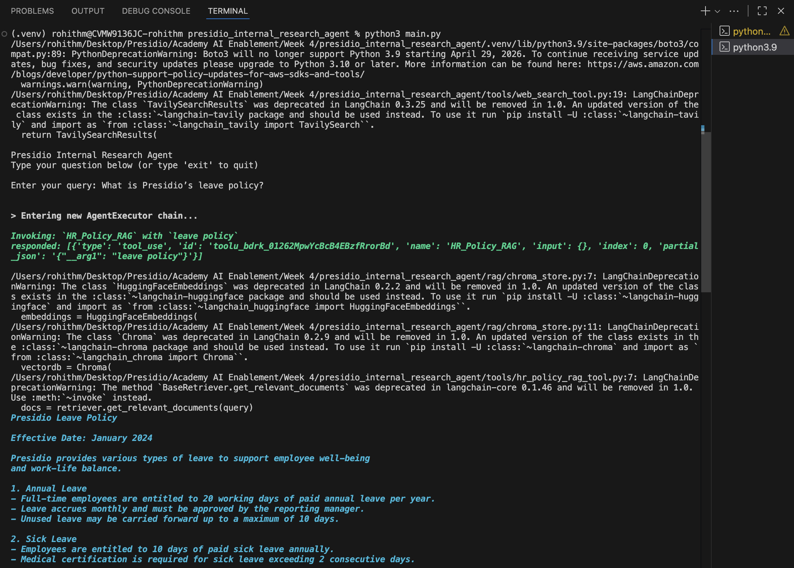

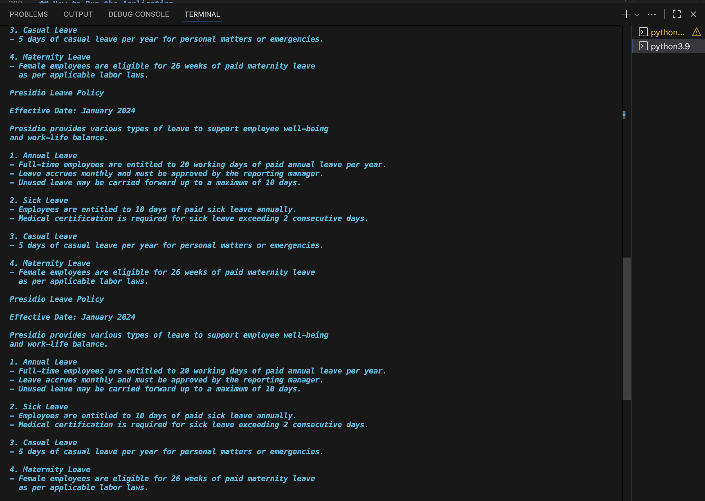

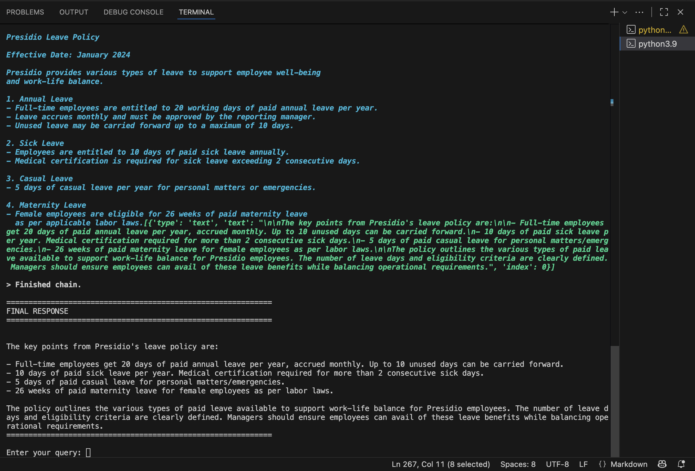

---

### Insurance Policy Question

> "What insurance coverage does Presidio provide to employees?"

➡ Uses **MCP Google Docs Tool**

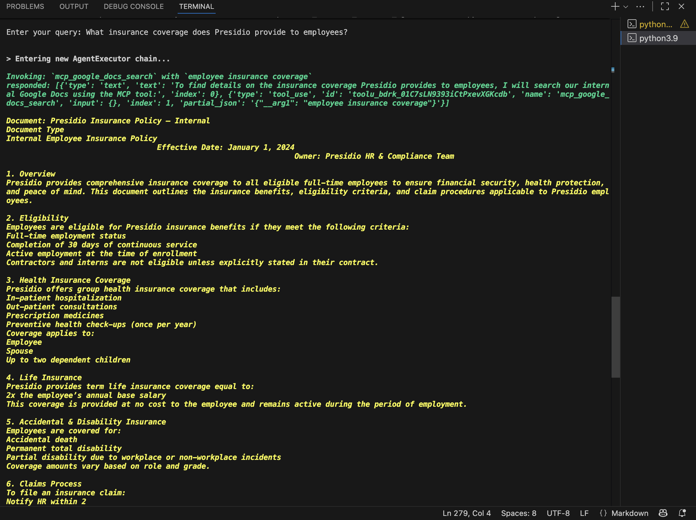

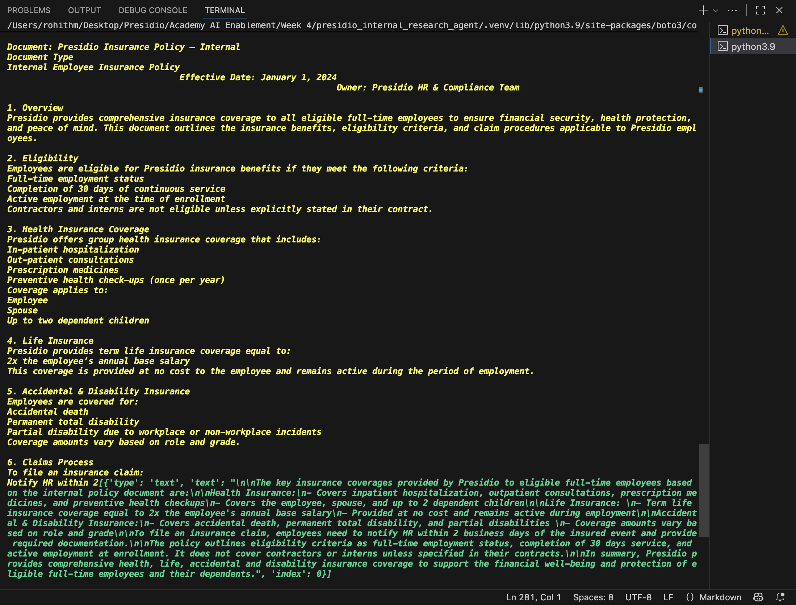

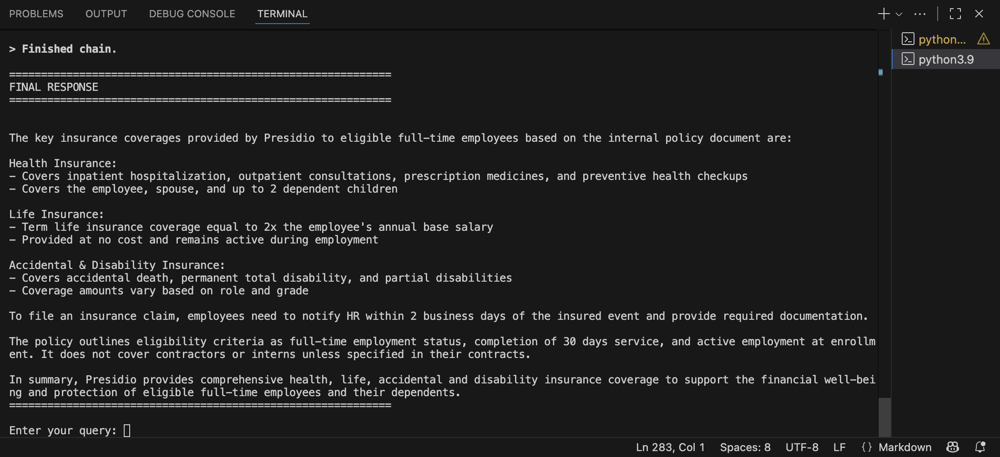

---

### Industry Benchmark Question

> "Compare hiring trend with industry benchmarks"

➡ Uses **Web Search Tool**

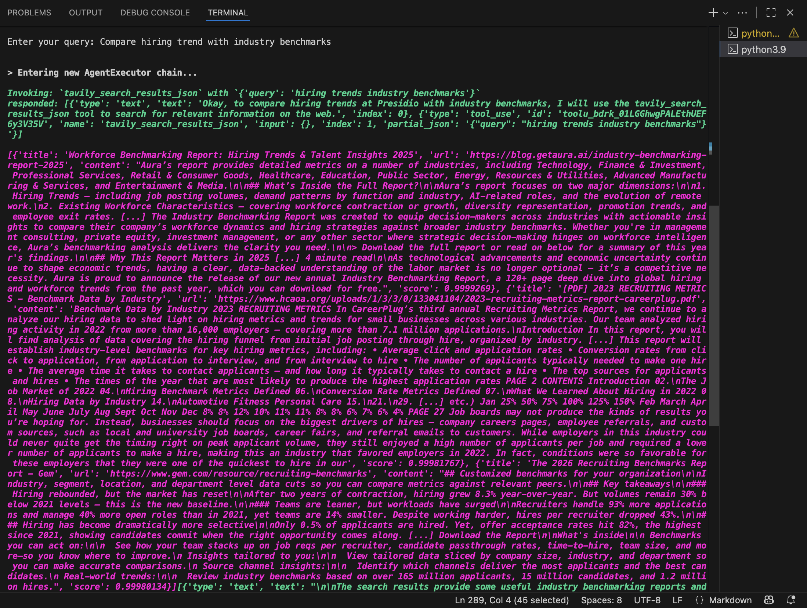

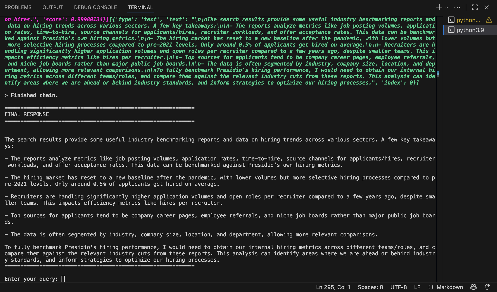

---

### Compliance Comparison

> "How does Presidio's insurance policy compare with industry standards?"

➡ Uses **MCP Google Docs Tool + Web Search**

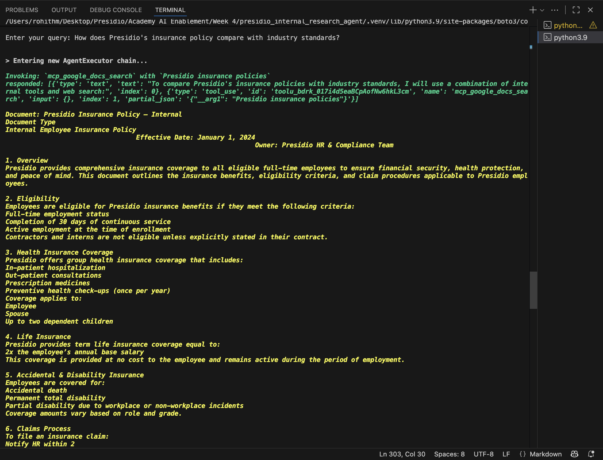

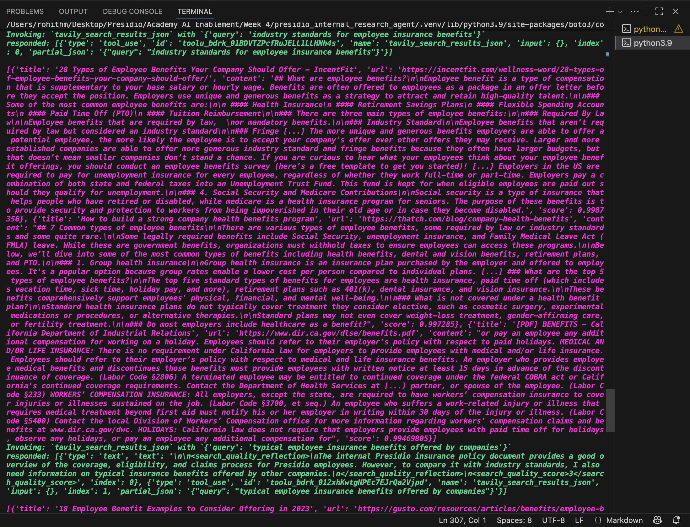

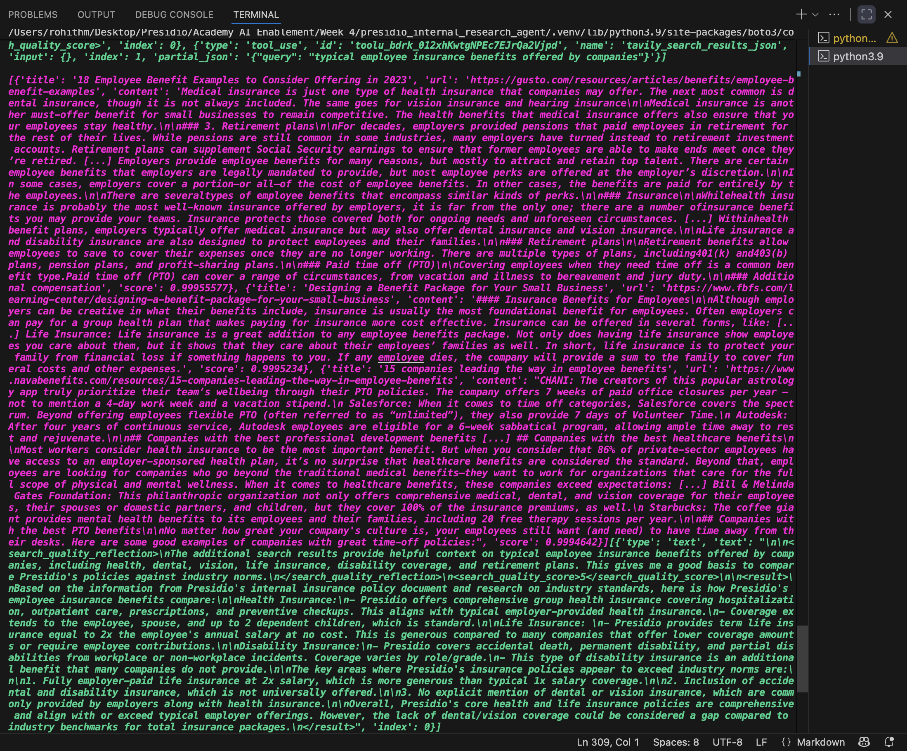

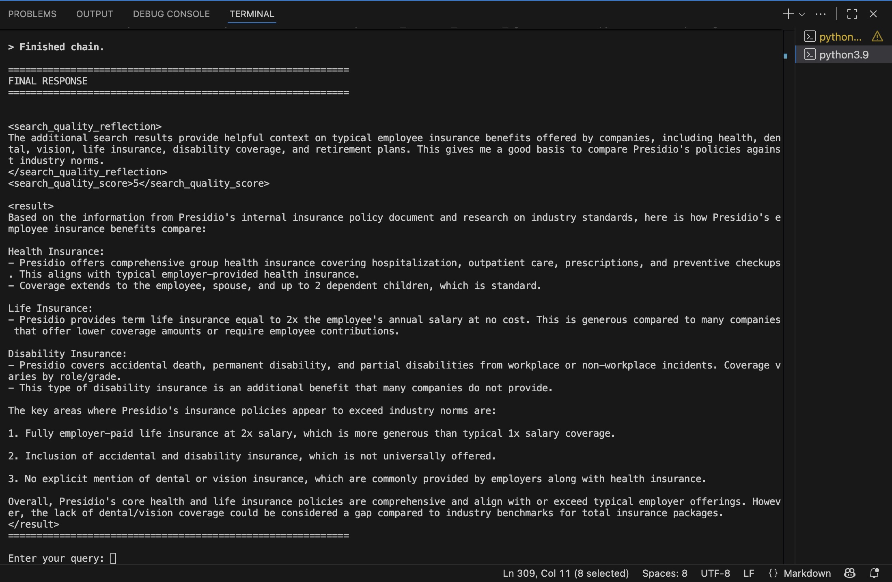

---

## Key Design Justifications

* **LangChain Agent** → Dynamic reasoning
* **RAG** → Grounded internal knowledge
* **MCP** → Secure enterprise integrations
* **Web Search** → Fresh external insights
* **Separation of concerns** → Scalable architecture

---

## Output

```
python3 -m rag.ingest_hr_policies
```

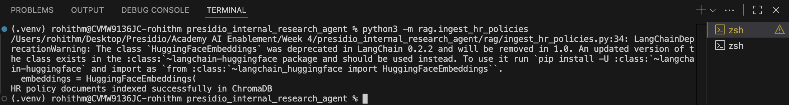

```
python3 -m mcp_google_docs_server.server
```

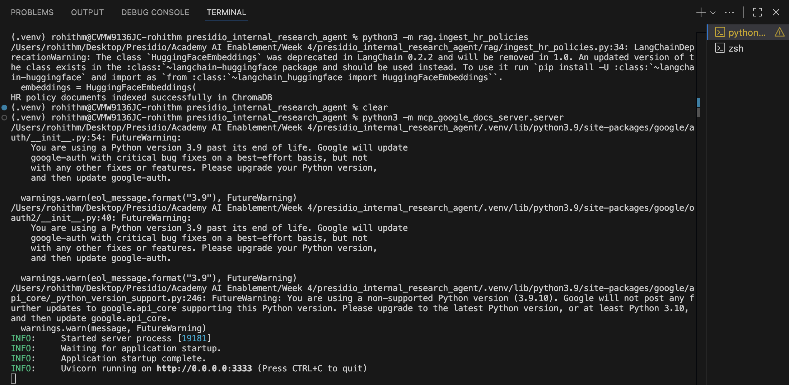


```
python3 main.py
```

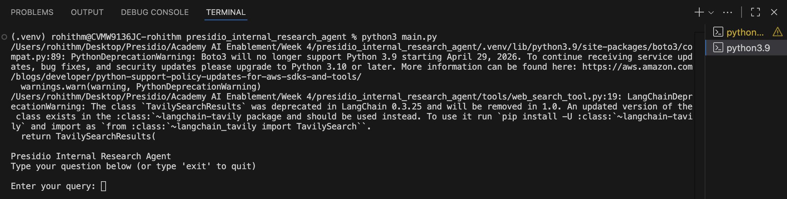


---

## Conclusion

This Internal Research Agent demonstrates how **LLMs + tools + enterprise data** can be combined to deliver **trustworthy, explainable, and scalable AI systems** for real business use cases at Presidio.

---

