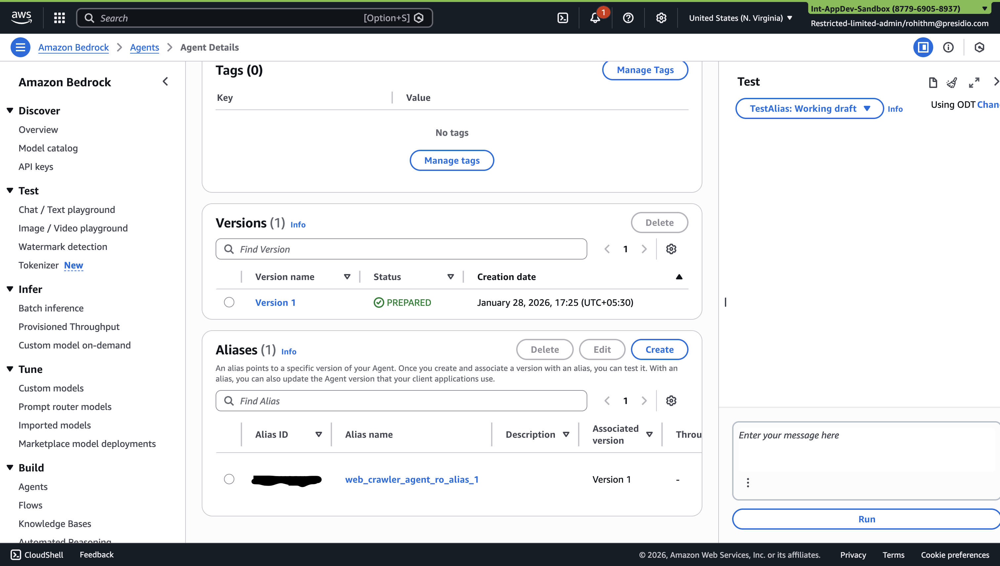
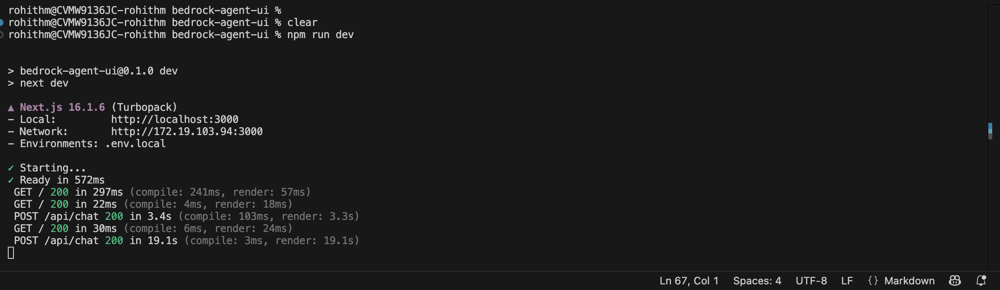
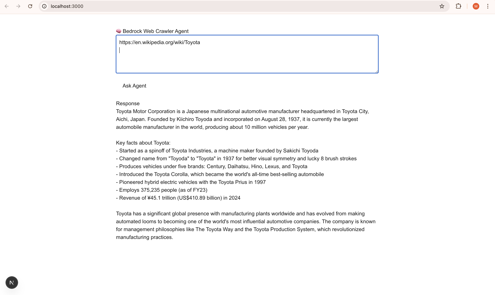

# Bedrock Agent UI

```
brew update
brew install node
```

## Configure AWS CLI

```
aws configure
```

## Create an Alias 



## What is Agent Alias ID (quick context)

In Bedrock:

- **Agent ID** → the agent itself

- **Agent Alias ID** → a deployable version of the agent (DRAFT, TEST, PROD, etc.)

👉 You **cannot invoke an agent without an alias.**

## env.example

```
AWS_REGION=us-east-1

BEDROCK_AGENT_ID=IXXXXXXXXX
BEDROCK_AGENT_ALIAS_ID=TXXXXXXXX
```

## Create an App

```
npx create-next-app@latest bedrock-agent-ui
```

## Project Structure

bedrock-agent-ui/
├── app/
│   ├── page.tsx               # UI
│   ├── layout.tsx
│   └── api/
│       └── chat/
│           └── route.ts       # Calls Bedrock Agent
├── components/
│   └── ChatBox.tsx
├── lib/
│   └── bedrock.ts             # Bedrock client
├── .env.local
├── package.json
└── README.md


## Output

```
npm run dev
```



Open

```
http://localhost:3000
```




