# Web‑Crawler Agent using AWS Bedrock

## Creation of an Agent

1. Go to Amazon Bedrock, click on Create Agent

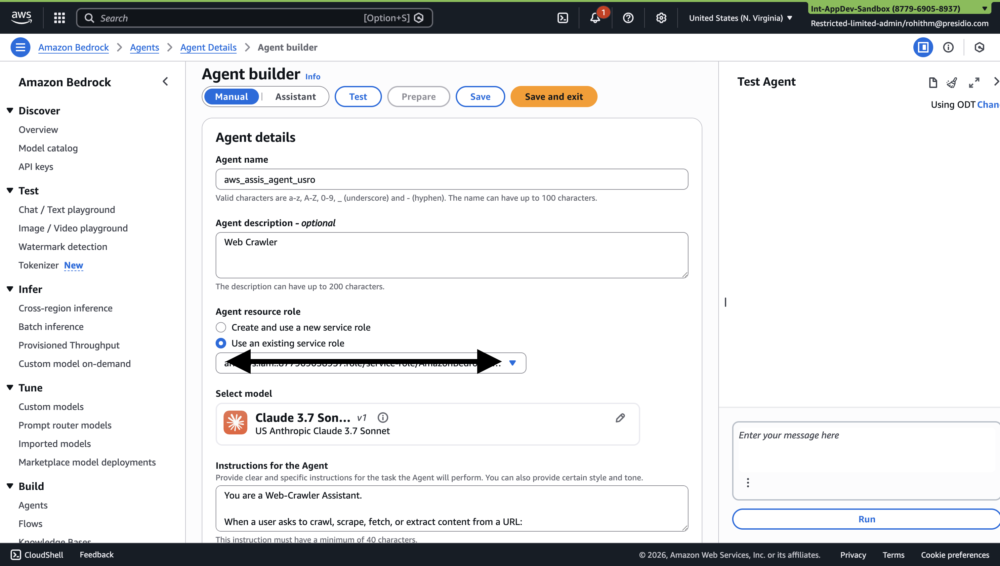

2. Initially Agent Resource Role should be Create and use a new service role

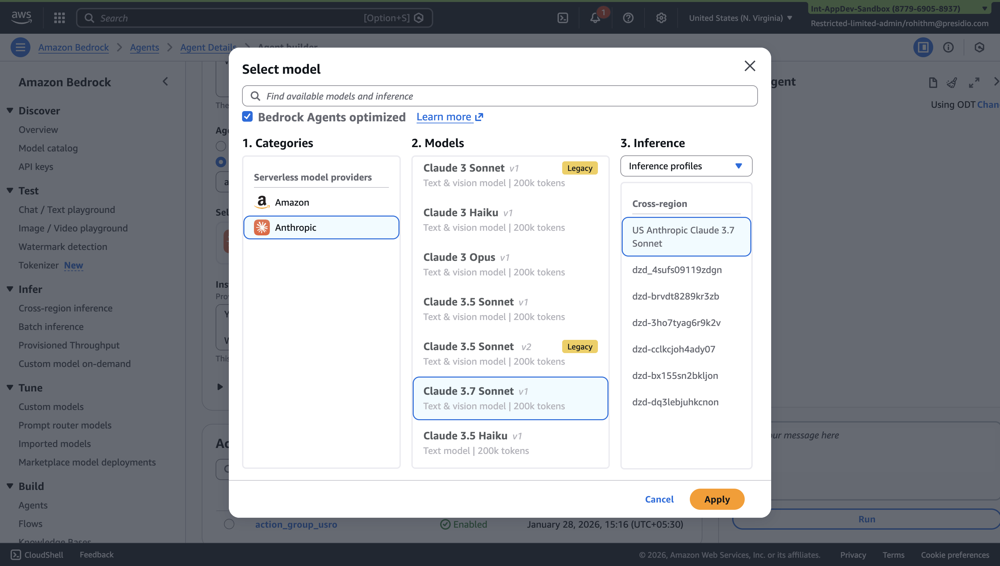

3. Select a model and click on appropriate model


4. Provide Instructions for the agent

5. Add action group

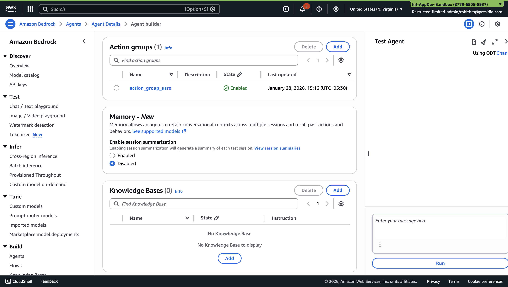


## Creation of Lambda function

1. Create a function with name, runtime and architecture

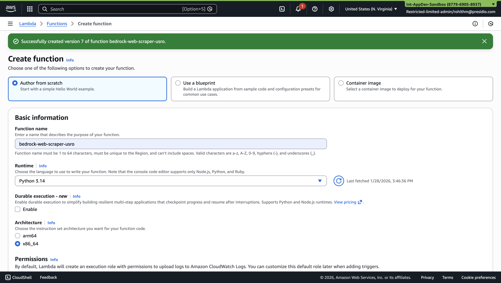

2. Click on Create Function

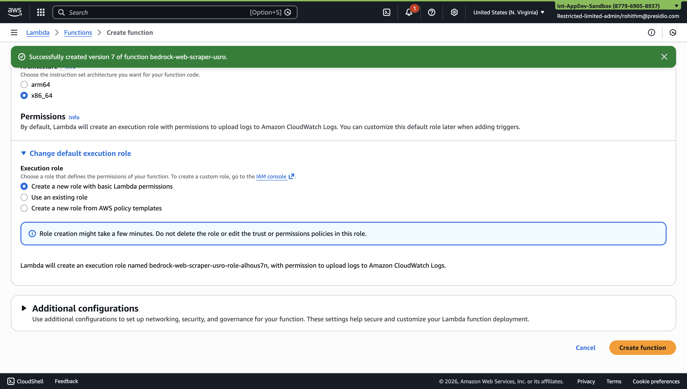

3. Create a layer in lambda

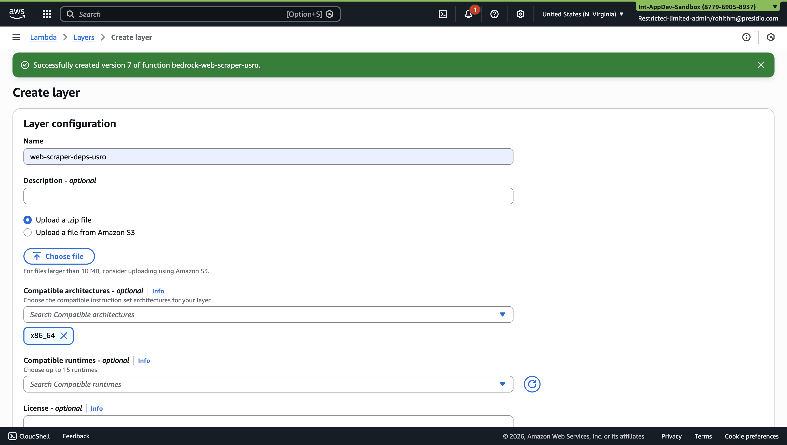

4. Create a zip file

```
pip install requests beautifulsoup4 -t python/
zip -r web-scraper-deps.zip python
```

5. Upload the zip file

6. Now go to Lambda function and add the layer

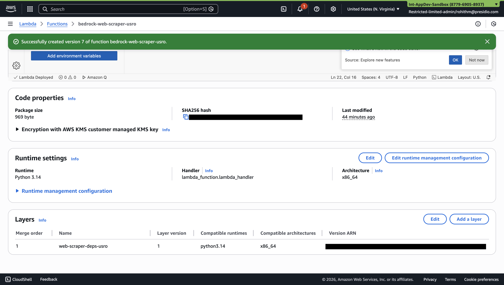

7. lambda_function.py

```
import requests
from bs4 import BeautifulSoup

MAX_BYTES = 1_000_000
MAX_TEXT_LENGTH = 25000

def extract_url(event):
    # 1️⃣ Try parameters (query/path params)
    for param in event.get("parameters", []):
        if param.get("name") == "url":
            return param.get("value")

    # 2️⃣ Try requestBody (JSON body)
    try:
        props = event["requestBody"]["content"]["application/json"]["properties"]
        for prop in props:
            if prop.get("name") == "url":
                return prop.get("value")
    except KeyError:
        pass

    return None

def lambda_handler(event, context):
    try:
        url = extract_url(event)
        print("url-", url)
        if not url:
            raise ValueError("Missing required parameter: url")

        headers = {
            "User-Agent": "Mozilla/5.0 (BedrockAgent/1.0)"
        }

        response = requests.get(url, headers=headers, timeout=15)
        response.raise_for_status()

        html = response.content[:MAX_BYTES]

        soup = BeautifulSoup(html, "html.parser")
        for tag in soup(["script", "style", "noscript", "iframe", "nav", "footer", "header"]):
            tag.decompose()

        text = " ".join(soup.get_text(separator=" ").split())
        text = text[:MAX_TEXT_LENGTH]

        return {
            "messageVersion": "1.0",
            "response": {
                "actionGroup": event["actionGroup"],
                "apiPath": event["apiPath"],
                "httpMethod": event["httpMethod"],
                "httpStatusCode": 200,
                "responseBody": {
                    "application/json": {
                        "body": {
                            "text": text,
                            "url": url,
                            "content_length": len(text)
                        }
                    }
                }
            }
        }

    except Exception as e:
        return {
            "messageVersion": "1.0",
            "response": {
                "actionGroup": event.get("actionGroup", ""),
                "apiPath": event.get("apiPath", ""),
                "httpMethod": event.get("httpMethod", ""),
                "httpStatusCode": 500,
                "responseBody": {
                    "application/json": {
                        "body": {
                            "error": str(e)
                        }
                    }
                }
            }
        }
```

8. Click on Actions and publish new version

9. Go to Configuration, General Configuration and increase the Timeout time.

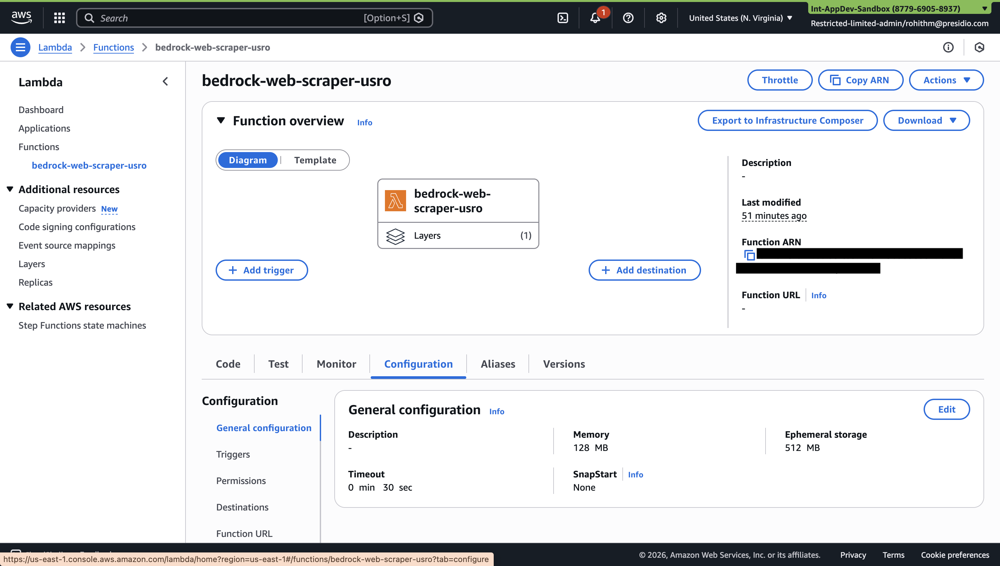

10. Go to Configuration, and then to Permissions and then click on Add Permission.

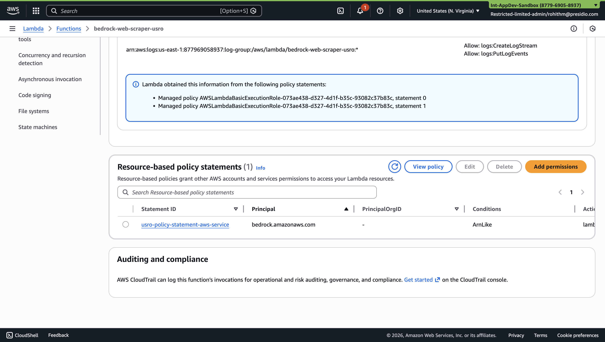

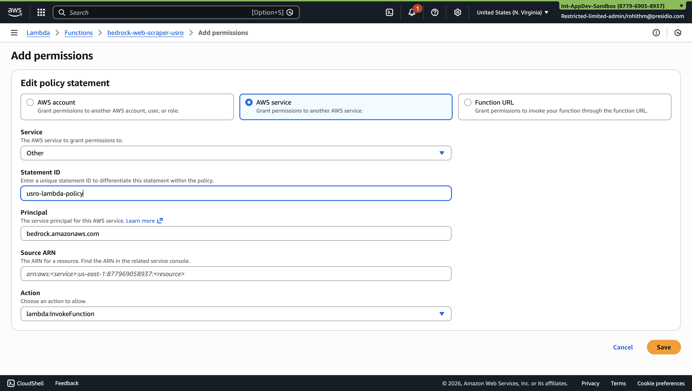

11. Provide the arn of the agent and create.


## Creation of Action Group

1. Provide action group name and action group type

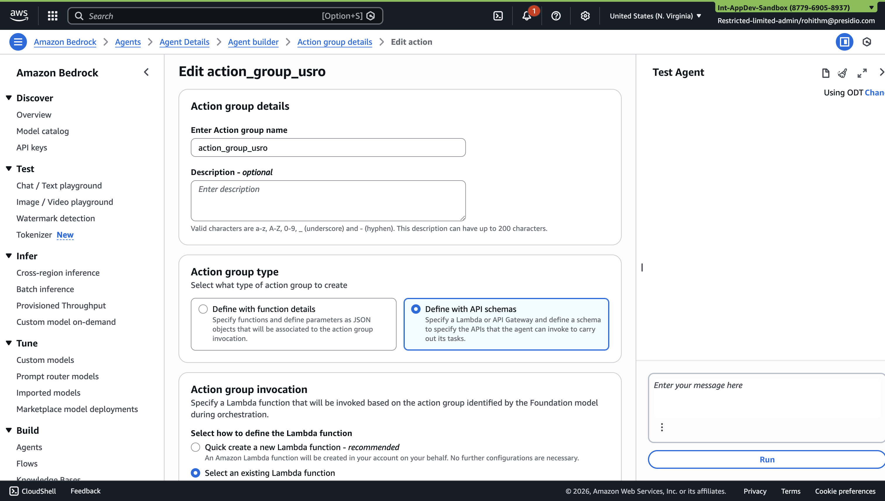

2. Select the lambda function

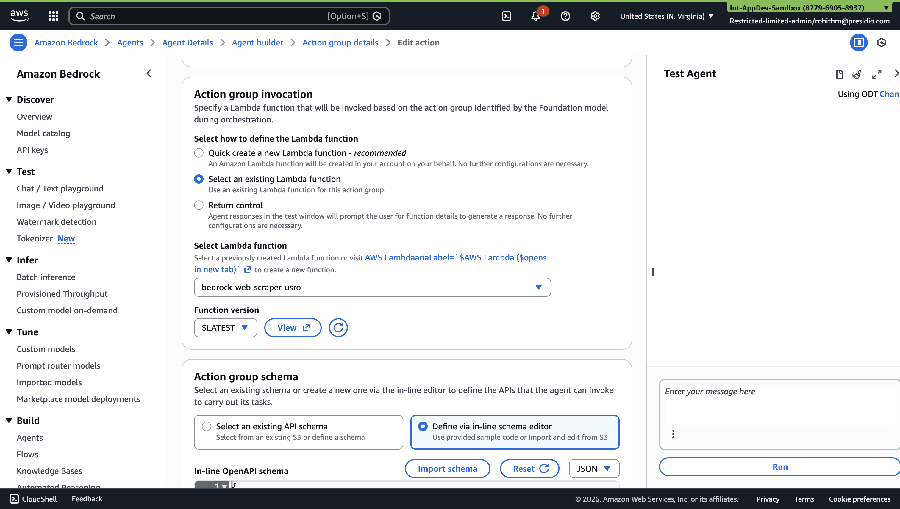

3. Enter the Action Group Schema (In-Line OpenAI Schema)

```
{
  "openapi": "3.0.0",
  "info": {
    "title": "Web Crawler Action API",
    "version": "1.0.0",
    "description": "Action API used by a Bedrock Agent to crawl a public webpage and extract clean text content for summarization and analysis"
  },
  "paths": {
    "/crawl": {
      "post": {
        "summary": "Crawl a public webpage",
        "description": "Fetches a publicly accessible URL, cleans HTML content, and returns extracted text that the agent can use for summarization oranalysis. Supports HTTP and HTTPS URLs.",
        "operationId": "crawlWebpage",
        "requestBody": {
          "required": true,
          "content": {
            "application/json": {
              "schema": {
                "type": "object",
                "properties": {
                  "url": {
                    "type": "string",
                    "description": "Public HTTP or HTTPS URL to crawl. Must be a valid, accessible webpage.",
                    "example": "https://en.wikipedia.org/wiki/India"
                  }
                },
                "required": ["url"]
              }
            }
          }
        },
        "responses": {
          "200": {
            "description": "Successfully extracted text from the webpage",
            "content": {
              "application/json": {
                "schema": {
                  "type": "object",
                  "properties": {
                    "text": {
                      "type": "string",
                      "description": "Plain text extracted from the webpage, with HTML tags and scripts removed"
                    },
                    "url": {
                      "type": "string",
                      "description": "The URL that was crawled"
                    },
                    "content_length": {
                      "type": "integer",
                      "description": "Length of the extracted text in characters"
                    }
                  },
                  "required": ["text"]
                }
              }
            }
          },
          "500": {
            "description": "Error while crawling or processing the webpage",
            "content": {
              "application/json": {
                "schema": {
                  "type": "object",
                  "properties": {
                    "error": {
                      "type": "string",
                      "description": "Error message describing what went wrong"
                    }
                  },
                  "required": ["error"]
                }
              }
            }
          },
          "504": {
            "description": "Request timeout - the webpage took too long to respond",
            "content": {
              "application/json": {
                "schema": {
                  "type": "object",
                  "properties": {
                    "error": {
                      "type": "string",
                      "description": "Timeout error message"
                    }
                  },
                  "required": ["error"]
                }
              }
            }
          }
        }
      }
    }
  }
}
```

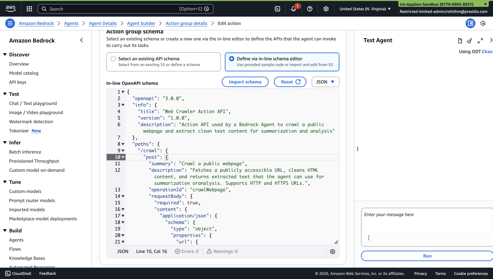


4. Click on Save and Exit

5. Make Sure to add Custom Inline Policy into the agent and provide the arn of the lambda function.

```
{
  "Version": "2012-10-17",
  "Statement": [
    {
      "Sid": "AllowLambdaInvoke",
      "Effect": "Allow",
      "Action": [
        "lambda:InvokeFunction"
      ],
      "Resource": [
        "arn:aws:lambda:REGION:ACCOUNT_ID:function:FUNCTION_NAME"
      ]
    }
  ]
}
```

6. Click Save and Exit

7. Click Prepare.

8. Test Now

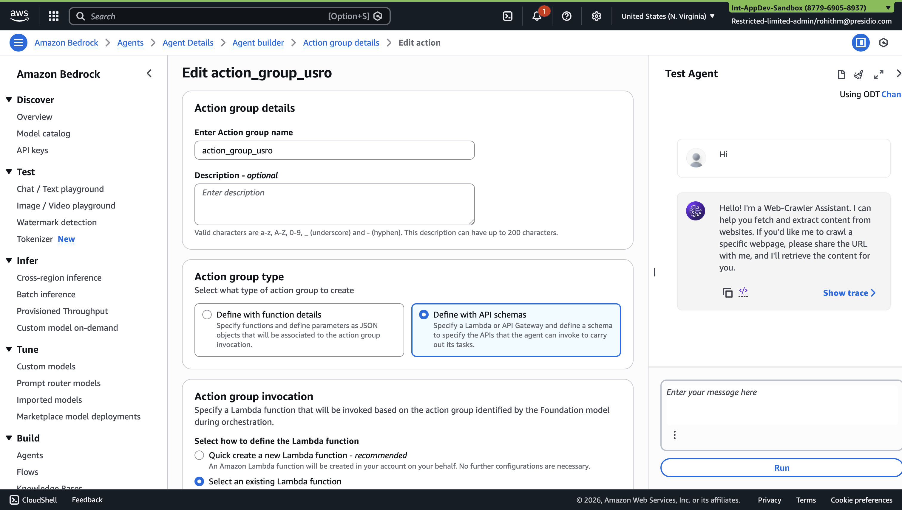

```
https://en.wikipedia.org/wiki/Toyota
summarize please
```

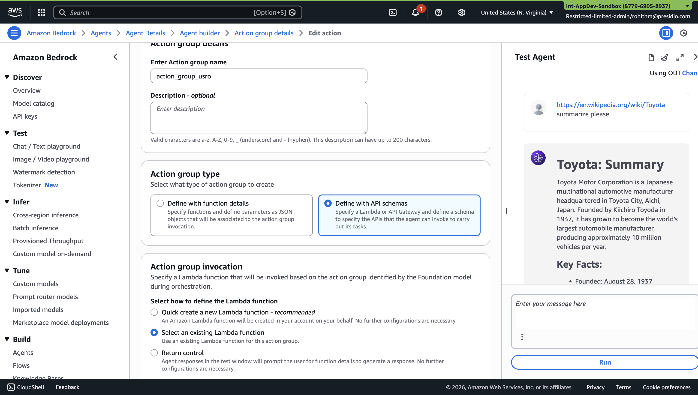

# Bedrock Agent UI

```
brew update
brew install node
```

## Configure AWS CLI

```
AWS CLI
```

## Create an Alias 


## What is Agent Alias ID (quick context)

In Bedrock:

- **Agent ID** → the agent itself

- **Agent Alias ID** → a deployable version of the agent (DRAFT, TEST, PROD, etc.)

👉 You **cannot invoke an agent without an alias.**

## env.example

```
AWS_REGION=us-east-1

BEDROCK_AGENT_ID=IXXXXXXXXX
BEDROCK_AGENT_ALIAS_ID=TXXXXXXXX
```

## Create an App

```
npx create-next-app@latest bedrock-agent-ui
```

## Project Structure

bedrock-agent-ui/
├── app/
│   ├── page.tsx               # UI
│   ├── layout.tsx
│   └── api/
│       └── chat/
│           └── route.ts       # Calls Bedrock Agent
├── components/
│   └── ChatBox.tsx
├── lib/
│   └── bedrock.ts             # Bedrock client
├── .env.local
├── package.json
└── README.md


## Output

```
npm run dev
```


Open

```
http://localhost:3000
```


